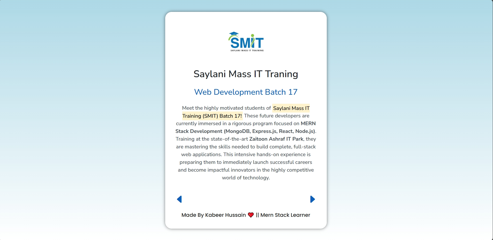

# 👥 Profile Slider (JavaScript Day 6)
**Live Demo:** [Click Here](https://profile-slider-kabeer-hussain.vercel.app)

A clean and responsive **Profile Slider Application** built using **pure JavaScript DOM manipulation**.  
This slider lets users navigate through multiple profiles with **smooth animations**, **touch support**, and **real-time dynamic updates** — all created without writing a single line of static HTML.

---

## 🚀 Features
✅ Fully dynamic UI generated with JavaScript  
✅ Previous/Next navigation buttons  
✅ Smooth image + text transition animations  
✅ Touch support for mobile devices  
✅ Responsive design for all screen sizes  
✅ Clean gradient background & modern card UI  
✅ Profiles update instantly (image, name, position, description)  
✅ Lightweight — zero frameworks used  

---

## 🧱 Tech Stack & Architecture
- **Frontend:** JavaScript (Vanilla) + CSS  
- **DOM Structure:** Built dynamically with `document.createElement()`  
- **State Management:** Index-based profile switching  
- **Mobile Handling:** Touchstart / touchend events  
- **Desktop Handling:** Hover + click effects  

---

## 🧠 How It Works
1. All profiles are stored inside a JavaScript array (`persons[]`).  
2. When the user clicks the next/previous button, the app updates:  
   - Profile image  
   - Name  
   - Position  
   - Description  
3. Animations smoothly transition between profiles.  
4. For mobile, dedicated **touch events** activate pressed effects.  
5. For desktop, hover effects + transitions give a premium look.

---

## 💡 Learning Goals
By building this project, you learn:
- Working with arrays and objects  
- DOM creation + styling entirely in JavaScript  
- Updating UI dynamically  
- Smooth transitions + animations  
- Responsive design logic  
- Touch gestures handling  

---

## 📸 Preview

---

## 🛠️ Developer Info
👨‍💻 **Developer:** Kabeer Hussain  
📘 **Series:** JavaScript — *30 Days, 30 Projects*  
📆 **Day:** 6 — *Profile Slider*  
📧 **Email:** codealpha0786@example.com  
🔗 **GitHub:** [ITechKabeer](https://github.com/ITechKabeer)

Made by Kabeer Hussain ❤️ || Mern Stack Learner

